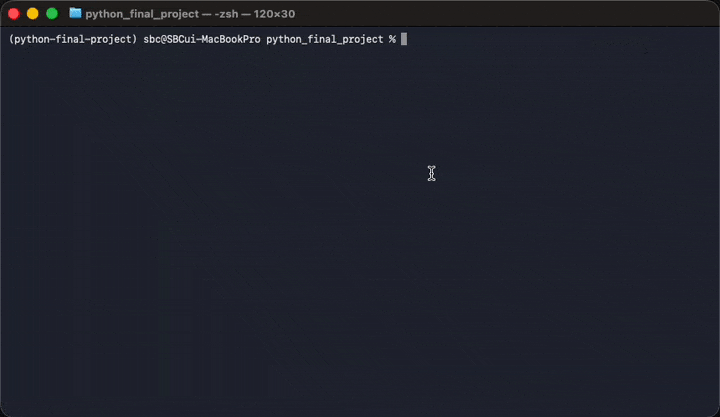
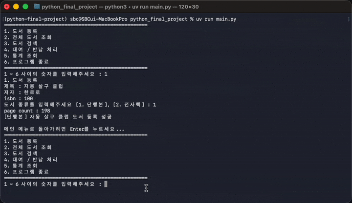
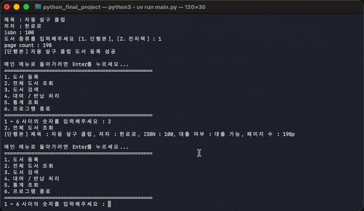
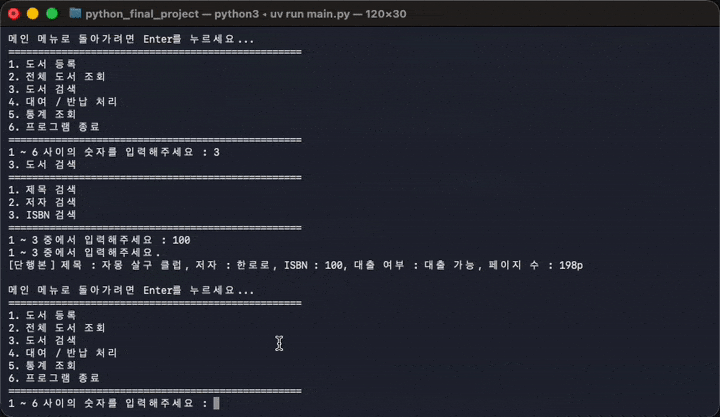
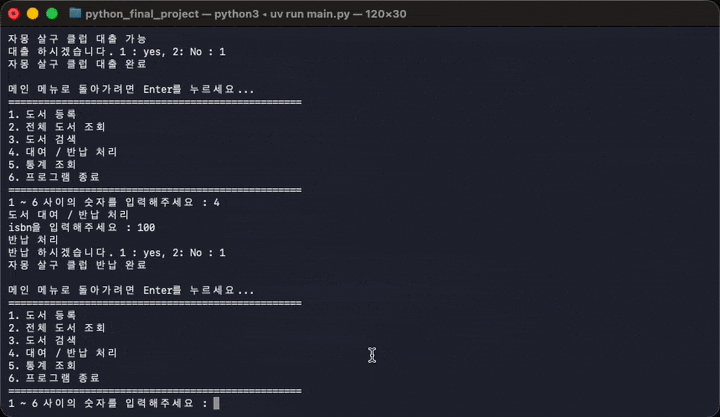
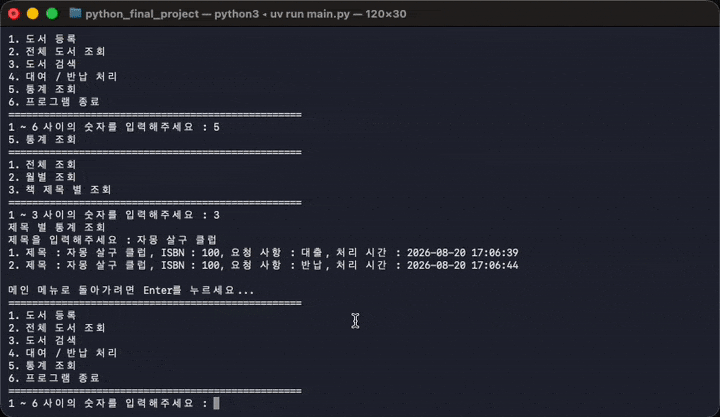

# 도서 대여 CLI 프로그램

### 저장소 클론

```
git clone git@github.com:tuski0/python_final_project.git
```

### 의존성 설치

```bash
uv sync
```

### 실행 방법

```bash
source .venv/bin/activate
uv run main.py
```

### 실행 화면

<h2> 실행 , 도서 등록 </h2>


<h2> 도서 전체 조회 </h2>


<h2> 도서 상세 검색 </h2>


<h2> 도서 대출 / 반납 </h2>


<h2> 도서 통계 조회 </h2>


<h2> 프로그램 종료 </h2>


### 주요 기능

- [x] 도서 등록
- [x] 도서 전체 조회
- [x] 도서 검색
- [x] 도서 대여 / 반납 처리
- [ ] 도서 통계 조회
- [x] 종료
